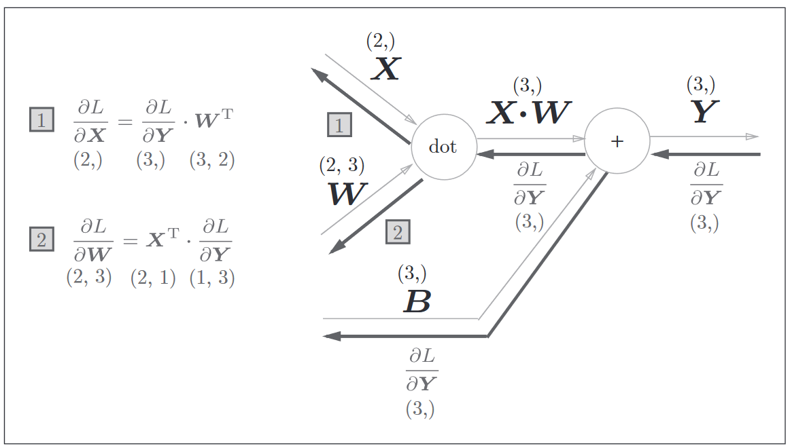

+++
title = "LML - linear regression"
date = 2024-05-01 23:43:25
+++

LML 是 Learn Machine Learning 的缩写，我会用文字和代码，从一个程序员的角度，记录下自己这段时间学习机器学习的过程。

这是第一篇：线性回归（与 softmax 回归）

<!-- more -->

- - -

## 理论篇

先从程序员的角度，从结论出发，带着问题进行答案寻找，这里我们要学习的内容是，线性回归和 softmax 回归。

### 什么是线性回归

1. 什么是回归

回归通常用来表示输入和输出的关系，比方说 y 是输出，x 是输入，他们之间存在某种联系，那么我们在建模这个问题的时候，有一类方法就叫做回归（regression）

而回归的目标通常是预测某个指标，比方说通过输入一个人的电脑使用时间长短和他头发的长短，预测出这个人是不是程序员，等等，而预测，往往是可以通过分类来实现，比方说我们知道的职业有，程序员，厨师，司机等等，那么我们的任务其实就是通过输入来给它进行分类。

2. 什么是线性回归

作为理工科学生，线性可以直观地从直线函数 y = ax + b 开始理解，在机器学习领域，我们把上面的公式推广到高维，意味着，y 可以表示为 x 的加权和加上一个（或一系列）常数，这种模型就叫做线性回归。

既然涉及到权重，在机器学习里面，通常用 w 表示，在这个模型中， w 和 x 是维度一样的数组，他们的加权和也就是矩阵乘法的点积。因此也可以用矩阵乘法来表示

那么模型的数学表达就是 y = x * w.T + b (.T 表示转置，这里用转置才能与 x 点积)

到这里，y, x, w, b 就都可以是高维度的了，可以表达很多具体问题

3. 更进一步

上面的模型 y = x * w.T + b ，我们也成为线性变换或是仿射变换。

从直线开始理解，直线函数  y = ax + b 里面，通过改变 a, b 的值，直线被平移、旋转，但它最后一定是一条直线，不可能是曲线或是转弯。

提升一个维度，多了一个 z 变量, y = ax + bz + c，表达一定总是一个平面，不可能有弯曲（写成 y = w1 * x1 + w2 * x2 + b 是等同的）。

再继续提升维度，我们没办法画出更高维度的图像，但是这个性质一直会保持，我们把这个高维空间的表达叫做超平面。

### 为什么能工作

为什么我们简单的线性模型能工作？训练部分的原理是什么？

假设一个问题能被线性模型表示，那么训练的过程实际上就是确定权重 w 和偏执 b 的过程；我们训练的流程大致是：

1. 用某种方式初始化权重 w 和偏置 b
2. 将已有的输入和输出（后面分别成为 x 和 y）带入，计算出当前模型的预测值 y'，计算 y' 和 y 之间的损失
3. 用某种方式减少 y' 与 y 的损失
4. 重复 2 - 3

其中的每一步都可以展开讲得非常详细，这里以不求甚解的态度去审视它，在使用过程中我们会逐渐找到感觉。

在线性回归中，我们显然不能使用 0 里初始化 w，这样会使得这个模型退化成一个常数，神经网络也就没那么有意义了（这是我自己的理解，如果有误解请多多指正，事实上据我所知 w 是可以为 0 但此时 b 一定不能为 0）。

我们通常使用 std=0, mean=0.01 的高斯分布作为初始化权重 w，使用 0 初始化 b。

在 3. 中，有两点可以引申出来：

- 量化损失，我们称量化损失的函数为损失函数，不同的模型可以有不同的损失函数
- 减少损失，简单的模型（比方说线性回归）存在解析解，那么我们可以用数学的形式解出来 w 和 b，找到损失最小时，具有数学意义的解；复杂的模型可能不存在解析解，于是我们会使用一些方式去引导损失函数减少（在数学中，这个过程的意义是对应的 w 和 b，关于训练数据的偏导数，使他们减少），这个过程常用的形式是随机梯度下降，我的理解是定义一个随机的步长，在沿着参数的偏导数的方向，前进一步。

损失函数跟随机梯度下降可以很有效地使得整个模型参数趋近于真实的线性参数。求梯度（或是偏导数）的过程往往就成为了关键，这里引申出的知识点是反向传播，读者可以自行搜索各种资料，我不再进行解释（水平不高，怕误人子弟），个人的观点是，首先理解“计算图”的概念，然后通过几个例子体会计算图正向和反向传播过程的计算流程，了解这是一种方便的手段，可以求得模型偏导数的方式（但它不是银弹，我们不要把它理解成解决所有问题的万能公式）。有了一些反向传播的印象之后，就可以直接去拿到前人（数学家们）推理得出的结论，作为工程师我们把它当成公式或是定理来进行对应的实现即可。

这里引用一张 《深度学习入门：基于Python的理论与实现》里的图

### 线性回归

有了线性回归模型的计算图，以及前向和反向传播的算法，我们就可以进行实现了。我的学习方法是：使用 ipynb 进行打草稿，再使用喜欢的语言用纯 cpu 的方式实现一次，这样对计算流程和细节可以有更深的体会。

可以参考这里的[笔记本](https://github.com/chux0519/lml/blob/master/linear/linear.ipynb)

我使用 pytorch 进行计算（因为模型比较简单，这里直接使用 autograd 特性）；

完成之后，再手动实现一下计算过程加深印象，比方说这里是同样一个问题的 [C 语言实现](https://github.com/chux0519/lml/blob/master/linear/linear.c)

### softmax 回归

TODO

https://github.com/chux0519/lml/blob/master/softmax/