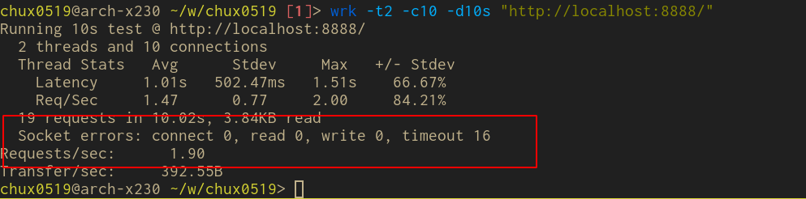

+++
title = "Non Blocking Tornado"
date = 2020-06-09T17:31:15+08:00
+++

tornado 是一个 python 的高性能 web 框架。最近在工作中遇到一个基于它的项目，在接口处该项目使用了大量的同步 io （数据库操作是同步的），意味着，某一时刻，在数据库 io 操作的时候，主线程是被阻塞的。这时新进来的请求得不到及时处理，会影响吞吐量。用户请求排队的时间也会变长。这里记录两种修改方式，提高吞吐量，使得这些操作不阻塞主线程。

<!-- more -->

优化思路有两个，一个是引入异步的数据库框架，逐步替换代码中访问频率高或是慢的api handler 代码，这样可以从根源上改变代码的运行模式，是 真×异步。

另一个思路是，利用 ThreadPoolExecutor，创建一个全局的线程池，同步的io可以全部扔到这里面，主线程不会被阻塞，代码逻辑很复杂，不便修改时，可以采用这个思路，好处是代码改动少。


下面举例说明如何修改

### 思路一，利用异步io
主要是用 aiopg 这个库去执行数据库操作。

这时直接将 API handler 定义为 async，比如 `async get`，`async post` 等。这时新的代码和老的代码区别在于对数据库的操作，从之前的 SQLAlchemy 到 aiopg。给个例子进行说明：

```python
    async def get(self):
        items = await self.get_all_items()
        self.write_jsonify(books)
...
    async def get_all_items(self):
        ret = []
        q = "select a from foo"
        items = await self.execute(q)
        for row in items:
            item = row.a # 处理逻辑，可以通过 row.a 访问到 a 字段
            ret.append(item)
        return ret
```

self.execute 是对 aiopg 操作的简单封装，见下面的代码

```python
    async def execute(self, q, n=None):
        async with self.aiodb.acquire() as conn:
            if n is None:
                return await (await conn.execute(q)).fetchall()
            elif n == 1:
                return await (await conn.execute(q)).first()
            else:
                return await (await conn.execute(q)).fetchmany(n)
```

更复杂的使用（事务等等），在需要时，参考 aiopg 文档。


### 思路二，利用线程池

当 handler 的逻辑比较复杂，全部改异步 io 十分麻烦时，可以考虑用这个方式，成本更低，改动更少。

我们在主线程创建一个全局的线程池，然后将想要重构的接口 `get` / `post` 等，加上一个装饰器，最后将 `self.write()` 的结果返回。
举个例子，假设某个同步 io 接口如下

```python
     @tornado.web.authenticated
     def get(self):
         items = self.get_items()
         self.write_jsonify(items)
```

修改的 diff 为

```python
     @tornado.web.authenticated
+    @unblock
     def get(self):
         items = self.get_items()
-        self.write_jsonify(items)
+        return items
```

需要注意的是，在 handler 内部，尽量不要调用 `self.write` 这类对请求响应的操作（这类操作不是线程安全的，装饰器里面会在主线程进行写操作）。所以 `self.write_execption` 之类的最好直接 raise，最后在主线程会写给用户。”最好不“不代表不能用，实际上我在测试时，使用过这写方法，没有遇到问题，但是还是尽量不要使用，避免奇怪的问题，实在很难改，已经用到了，要充分测试。

unblock 装饰器的实现类似 tornado 的 `run_on_executor`，但是简化了很多，直接将整个 api handler 的逻辑都放到了线程池，不用更多的代码修改了。下面是实现

```python
def unblock(http_method):
    @tornado.web.asynchronous
    @functools.wraps(http_method)
    def _wrapper(self, *args, **kwargs):
        # callback must be called on the main thread
        # self.write(),self.finish() etc are not thread safe
        def callback(future):
            res = future.result()
            if res is None:
                self.finish()
                return
            if not isinstance(res, str):
                res = json_dumps(res)
            self.write(res)
            self.finish()
        _future = EXECUTOR.submit(
            functools.partial(http_method, self, *args, **kwargs)
        )
        ioloop.IOLoop.instance().add_future(_future, callback)
    return _wrapper
```

这里给出一个完整的例子

```python
import tornado.ioloop
import tornado.web
import time
import functools
from concurrent.futures import ThreadPoolExecutor

EXECUTOR = ThreadPoolExecutor(50)


def unblock(http_method):
    @tornado.web.asynchronous
    @functools.wraps(http_method)
    def _wrapper(self, *args, **kwargs):
        # callback must be called on the main thread
        # self.write(),self.finish() etc are not thread safe
        def callback(future):
            res = future.result()
            if res is None:
                self.finish()
                return
            self.write(res)
            self.finish()
        _future = EXECUTOR.submit(
            functools.partial(http_method, self, *args, **kwargs)
        )
        tornado.ioloop.IOLoop.instance().add_future(_future, callback)
    return _wrapper


class MainHandler(tornado.web.RequestHandler):
    @unblock
    def get(self):
        time.sleep(0.5)
        self.write("Hello, world")


def make_app():
    return tornado.web.Application([
        (r"/", MainHandler),
    ])


if __name__ == "__main__":
    app = make_app()
    app.listen(8888)
    tornado.ioloop.IOLoop.current().start()
```

运行后，使用 `wrk` 进行 benchmark 可以看到区别。

同步版本


用了线程池的同步版本


### 最后

在涉及 io 操作的地方，能使用异步的方式就使用，比如 redis，http 请求，数据库连接等等，避免阻塞主线程


