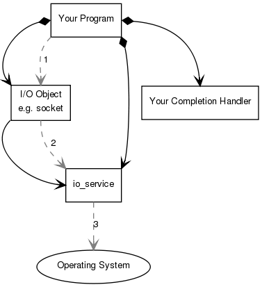
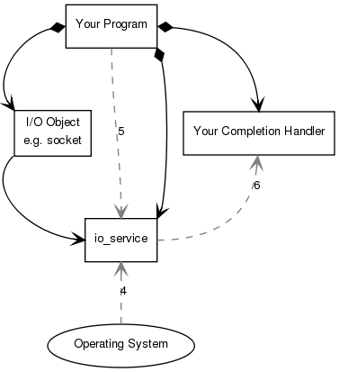
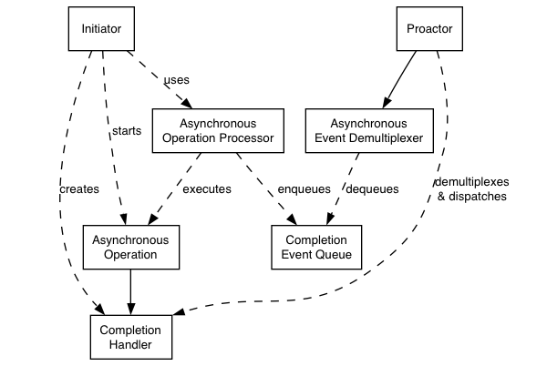

## boost asio 笔记

使用 boost asio 可以跨平台处理异步操作，这里对如何使用（异步）进行简单摘要

## 异步操作

1. 程序需要初始化一个 "io object"(socket)，将 socket 和其完成后的 handler 进行关联

> socket.async_connect(server_endpoint, your_completion_handler);

其中，`your_completion_handler` 函数签名是

> void your_completion_handler(const boost::system::error_code& ec);

2. "io object" 将请求转交给 `io_context`

3. `io_context` 给操作系统发信号，说明现在开始发起一个异步的连接了

4. 过了一段时间之后，操作系统发现连接请求完成了，它会把结果放进一个队列，这说明结果已经可用了，可以被 `io_context` 取出来了

5. 程序必须调用 `io_context::run()` 来保证结果被取出来，需要注意的是，这个操作是 block 的。

6. 当 `io_context::run()` 被调用的时候，它会取出结果，翻译 `error_code` 然后传给在 1 中定义的 handler

示意图如下

## Proactor 模式

不需要线程的并发模型，在 asio 中的实现大概如图下

其中各个组件的职责/定义如下

### Asynchronous Operation

定义异步操作，比如异步读写一个 socket

### Asynchronous Operation Processor

执行异步操作的地方，同时负责将操作完成事件放进 `Completion Event Queue`，一个例子就是 `reactive_socket_service`

### Completion Event Queue

是一个缓存队列，用户存储操作完成的事件，一直到 `Asynchronous Event Demultiplexer` 把它取出

### Completion Handler

处理异步操作的结果，是 function 对象，通常使用 `boost::bind` 创建

### Asynchronous Event Demultiplexer
  (阻塞地)等待 `Completion Event Queue` 中的事件发生，然后将完成事件传给调用者

### Proactor

  调用 `Asynchronous Event Demultiplexer` 去取完成事件，然后分发给 `Completion Handler`，通常 `io_context` 充当这个角色

### Initiator

  发起异步操作的业务代码，通常通过高层的接口进行调用，比如通过 `basic_stream_socket`，实际上底层是将其操作代理给了 `reactive_socket_service`

## 缺点

优点不详述了（可移植性，解耦线程和并发等等），这里主要贴两个缺点

1. 很多组件让程序变得更复杂
2. 内存的占用（queue 的出现使得内存占用变高，主要相对于 reactor 模式，reactor 模式在 socket 可读或可写时，都不会有额外的 buffer 的内存开销）

## 链接

- [boost_asio/overview/core/basics.html](https://www.boost.org/doc/libs/1_66_0/doc/html/boost_asio/overview/core/basics.html)
- [boost_asio/overview/core/async.html](https://www.boost.org/doc/libs/1_66_0/doc/html/boost_asio/overview/core/async.html)

